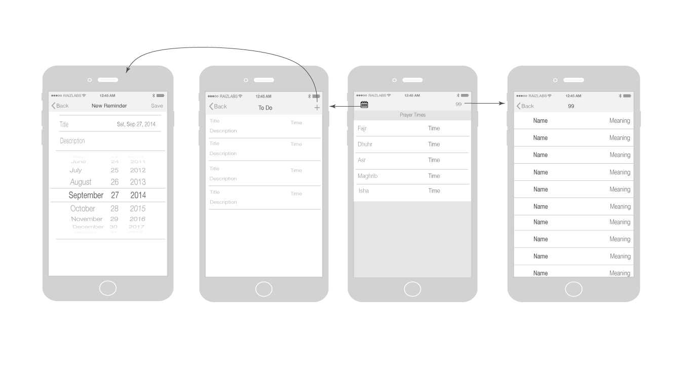

Apps purpose is to make learning Islam easier.
Allows users to have a personalized to do list/reminders and learn the 99 Names of Allah. App needs location and notification permission.
 
Gets prayer times by calling API I found on https://aladhan.com/prayer-times-api

http://api.aladhan.com/v1/timingsByCity/:date_or_timestamp

Ex: http://api.aladhan.com/v1/timings/1398332113?latitude=51.508515&longitude=-0.1254872&method=2

To make an API request, API requires a timestamp, location (obtained using CoreLocation) and a method number 
that accepts values 0-14 and 99.

Original wireframe:

